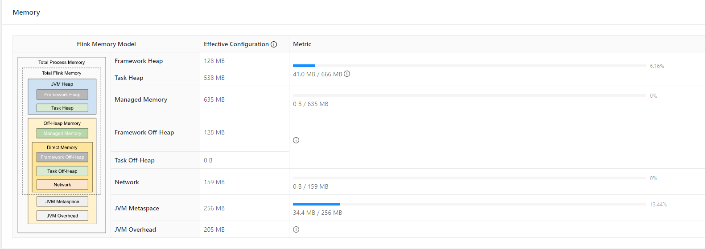

# FlinkTuning

## 资源配置调优

### TaskManager内存模型



#### JVM Heap

- Framework Heap

```txt
Framework heap其实是为Task Executor本身所配置的堆内存大小，因为Task Executor本身也是一个Java。
Framework Heap是Flink框架保留的，是不会用来执行Task的。
该堆的大小由taskmanager.memory.framework.heap.size参数控制，它的运行所需资源比较轻量级，默认为128M。
```

- Task Heap
```txt
Task Heap Memory是专门用于执行Flink任务的堆内存空间。
该堆的大小由taskmanager.memory.task.heap.size参数指定。
这个参数的默认为：Total Flink Memory – Framework Heap – Task off-heap memory – Managed Memory – Network Memory。
```

#### Off-Heap Memory

- Managed Memory
```txt
Managed Memory是由Flink直接管理的off-heap内存，它主要用于排序、哈希表、中间结果缓存、RocksDB的backend。
其实它是Task Executor管理的off-heap内存。它可以由taskmanager.memory.managed.size 参数直接配置指定，默认是不配置的。
默认是通过taskmanager.memory.managed.fraction配置的因子（默认0.4）来设置Managed off-heap memory，默认为Total Flink Memory的40%
```

- JVM Metaspace
```txt
从JDK 8开始，JVM把永久代拿掉了。类的一些元数据放在叫做Metaspace的Native Memory中。
在Flink中的JVM Metaspace Memory也一样，它配置的是Task Manager JVM的元空间内存大小。
通过taskmanager.memory.jvm-metaspace.size参数配置，默认为256MB。
```

- JVM Overhead
```txt
保留给JVM其他的内存开销。例如：Thread Stack、code cache、GC回收空间等等。
和Network Memory的配置方法类似。它也由三个配置决定：
taskmanager.memory.jvm-overhead.min：默认为192MB，
taskmanager.memory.jvm-overhead.max：默认为1GB
taskmanager.memory.jvm-overhead.fraction：默认为0.1。
```

#### Direct Memory（Off-Heap）
- Framework Off-heap
```txt
Task Executor保留的off-heap memory，不会分配给任何slot。
可以通过taskmanager.memory.framework.off-heap.size参数指定，默认为128M。
```
- Task Off-heap
```txt
Task Executor执行的Task所使用的堆外内存。如果在Flink应用的代码中调用了Native的方法，需要用到off-heap内存，这些内存会分配到Off-heap堆外内存中。
可以通过指定taskmanager.memory.task.off-heap.size来配置，默认为0。
如果代码中需要调用Native Method并分配堆外内存，可以指定该参数。
一般不使用，所以大多数时候可以保持0。
```
- Network
```txt
Network Memory使用的是Directory memory，在Task与Task之间进行数据交换时（shuffle），需要将数据缓存下来，缓存能够使用的内存大小就是这个Network Memory。
它由是三个参数决定：
taskmanager.memory.network.min：默认为64MB
taskmanager.memory.network.max：默认为1gb
taskmanager.memory.network.fraction：默认为0.1
```

#### 计算
`taskmanager.memory.process.size: 2048m`
```sh
JVM Options:
-XX:+UseG1GC
-Xmx697932173
-Xms697932173
-XX:MaxDirectMemorySize=300647712
-XX:MaxMetaspaceSize=268435456
```
- 使用G1GC来进行垃圾回收
- 堆内存:约666M
- 直接内存：约287M
- 元空间内存：256M

```
JVM元空间：256M
JVM执行开销：2048M*0.1=204.8M 在[192M,1G]之间
Flink内存：2048-256-204.8=1587.2M
网络内存：1587.2*0.1=158.72 在[64M,1G]之间
管理内存：1587.2*0.4=634.88M
框架内存：128M(堆内、堆外)
Task堆内内存：1587.2-2*128-158.72-634.88=537.6M
```

### 合理利用CPU资源
> yarn的容量调度器默认情况下使用`DefaultResourceCalculator`分配策略，只根据内存调度资源，每个容器默认分配一个vcore，可以修改为`DominantResourceCalculator`,会综合考虑Cpu和内存的情况，在capcity-scheduler.xml中修改：
```xml
<property>
    <name>yarn.scheduler.capacity.resource-calculator</name>
    <!-- <value>org.apache.hadoop.yarn.util.resource.DefaultResourceCalculator</value> -->
    <value>org.apache.hadoop.yarn.util.resource.DominantResourceCalculator</value>
</property>
```
> 使用`DominantResourceCalculator`策略后一个slot默认分配一个vcore

>使用`DominantResourceCalculator`策略后并指定容器vcore数  
-Dyarn.containers.vcores=3（每个container分配3个vcore）